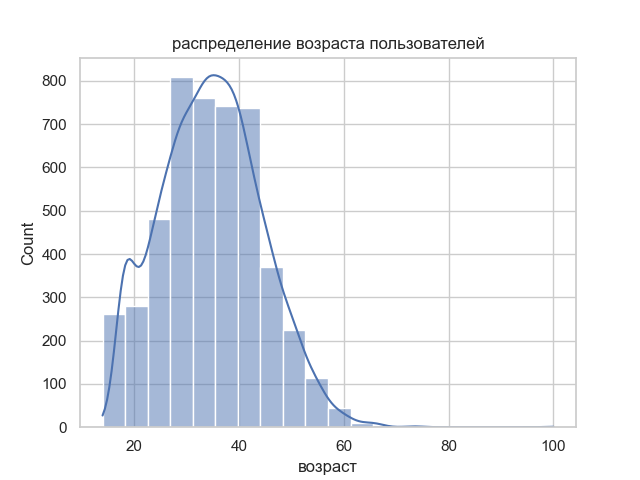
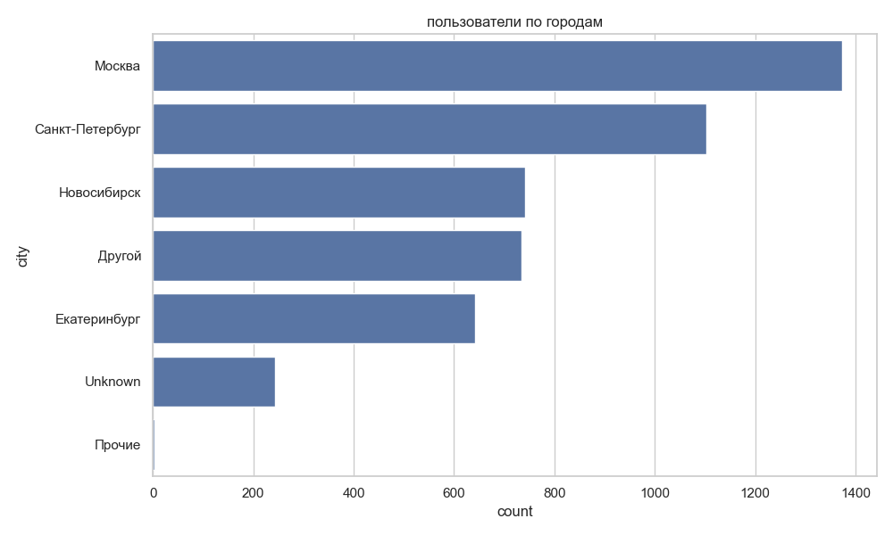
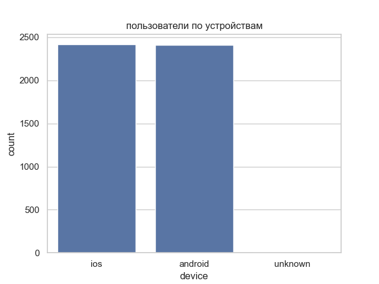
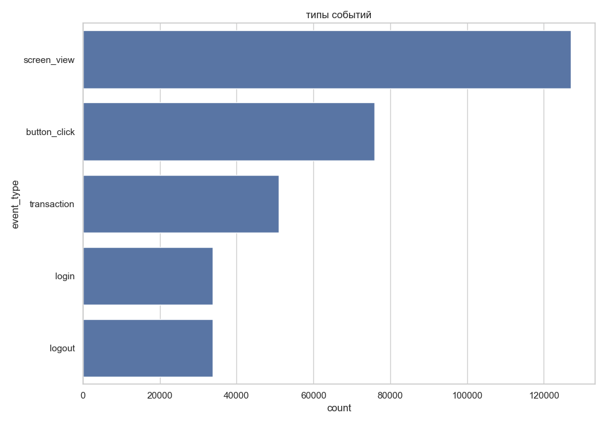
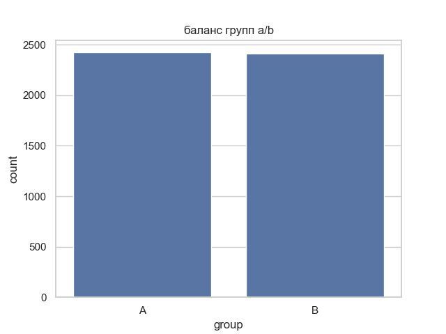
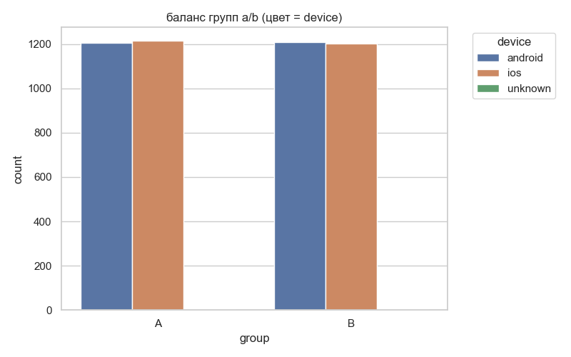

В ./data лежат необработанные файлы:
* events_ab.csv
* users_ab.csv
* visits_daily.csv
* data.xlsx - сведенные в один файл (на разные страницы) необработанные таблички events_ab.csv, users_ab.csv, visits_daily.csv

simple_data_update.py - обработка данных из /data (создание /data_processed) и создание графиков (/eda_plots)

В ./data_processed находятся предобработанные файлы (удалены дубликаты, заполнены пропуски и т.д.)
* events_processed.csv
* users_processed.csv
* visits_processed.csv

В ./eda_plots лежат графики:
1) Распределения возрастов
2) Пользователи по городам
3) Пользователи по устройствам
4) Количества всех действий
5) Количество пользователей из групп A и B
6) Количество пользователей из групп A и B по типу устройства
7) Количество пользователей из групп A и B по типу устройства (другой вид)

Графики

")